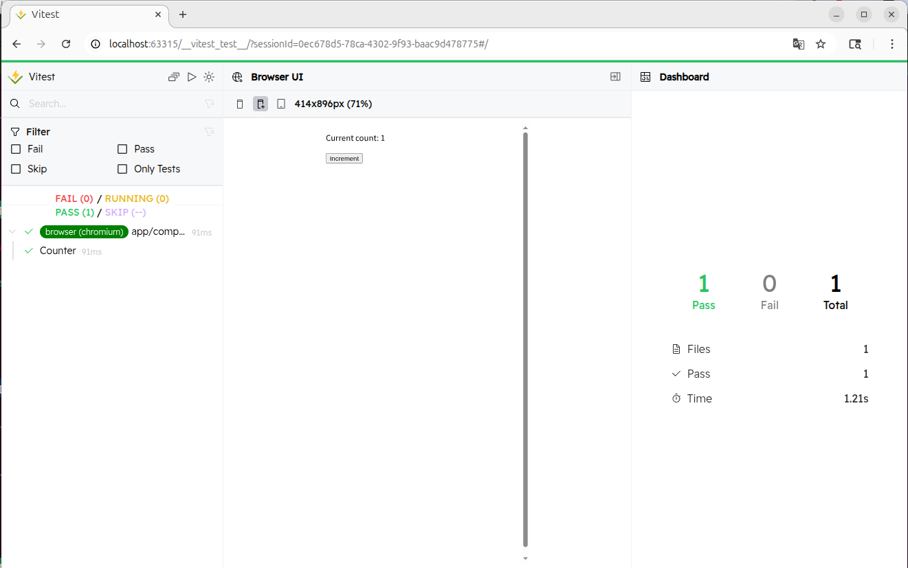

## Vitest Browser Mode

Vitest の Browser Mode はブラウザ上でテストを実行できる機能です。

公式サイトによると、

> to help improve testing workflows and achieve more accurate and reliable test results.

とのこと。

## インストールと初期設定

以下のコマンドでインストールする。

```bash
npx vitest init browser
```

すると Playwrightなどのインストールとともにサンプルファイルと `vitest.browser.config.ts` という設定ファイルが自動生成される。

```
$ git status
ブランチ main
Changes not staged for commit:
  (use "git add <file>..." to update what will be committed)
  (use "git restore <file>..." to discard changes in working directory)
	modified:   package-lock.json
	modified:   package.json

追跡されていないファイル:
  (use "git add <file>..." to include in what will be committed)
	vitest-example/
	vitest.browser.config.ts

no changes added to commit (use "git add" and/or "git commit -a")
```

## 問題点

さて、この状態だと問題がある。

- Vitest の設定は `vite.config.ts` に書いているのでブラウザモード用のファイルは新しくできてほしくない。
  - 👉 Vitest はテストプロジェクトが設定できるので2つのプロジェクトを作成
- ロジックのテストを実行したときにブラウザのテストが動く。
  - 👉 ブラウザのテストは `.browser.test.tsx` という命名にすることで区別する

これらを解消するために `vite.config.ts` は以下のようにした。

```ts
/// <reference types="vitest/config" />
import { reactRouter } from "@react-router/dev/vite"
import { playwright } from "@vitest/browser-playwright"
import { defineConfig } from "vite"
import tsconfigPaths from "vite-tsconfig-paths"
import { defaultExclude } from "vitest/config"

export default defineConfig({
  plugins: [reactRouter(), tsconfigPaths()],
  define: {
    "import.meta.vitest": false,
  },
  test: {
    projects: [
      {
        test: {
          name: "unit",
          includeSource: ["app/**/*.{js,ts}"],
          // defaultExclude は node_modules などを除外する
          exclude: [...defaultExclude, "**/*.browser.test.{ts,tsx,js,jsx}"],
        },
        plugins: [tsconfigPaths()],
      },
      {
        test: {
          name: "browser",
          include: ["app/**/*.browser.test.{ts,tsx,js,jsx}"],
          browser: {
            enabled: true,
            provider: playwright(),
            // https://vitest.dev/config/browser/playwright
            instances: [{ browser: "chromium" }],
          },
        },
        plugins: [tsconfigPaths()],
      },
    ],
  },
})
```

## NPMスクリプトの設定

`package.json` はそれぞれのテストが実行できるようにしておく。

```json
  "scripts": {
    "test": "vitest --project unit",
    "test:browser": "vitest --project browser"
  },
```

## テストコードを書いてみる

```tsx
import { useState } from "react"

export function Counter() {
  const [count, setCount] = useState(0)

  return (
    <div>
      <p>
        Current count: <output>{count}</output>
      </p>
      <button type="button" onClick={() => setCount(c => c + 1)}>
        Increment
      </button>
    </div>
  )
}
```

```tsx
import { expect, test } from "vitest"
import { render } from "vitest-browser-react"
import { Counter } from "./Counter"

test("Counter", async () => {
  const screen = await render(<Counter />)

  const output = screen.getByRole("status")
  const button = screen.getByRole("button", { name: "Increment" })

  await expect.element(output).toHaveTextContent("0")

  await button.click()

  await expect.element(output).toHaveTextContent("1")
})
```

テストできてる！



## GitHub Actions (CI) での実行

CI環境でブラウザテストを動かすには、ブラウザ本体のインストールが必要。
そのインストールというのが少々時間がかかるので、ここでも job を分けて並列実行することで CI の実行時間を減らす。

```yaml
// .github/workflows/test.yml
jobs:
  unit-test
    #
    # 既存のテストを書く
    #
  browser-test:
    name: Browser Tests
    runs-on: ubuntu-latest
    container:
      image: mcr.microsoft.com/playwright:v1.58.2-noble
      options: --user 1001
    steps:
      - uses: actions/checkout@v5
      - uses: actions/setup-node@v6
        with:
          node-version: lts/*
      - name: Install dependencies
        run: npm ci
      - name: Run your tests
        run: npm run test:browser
```

# 参考

- https://vitest.dev/guide/browser/
- https://vitest.dev/guide/projects.html
